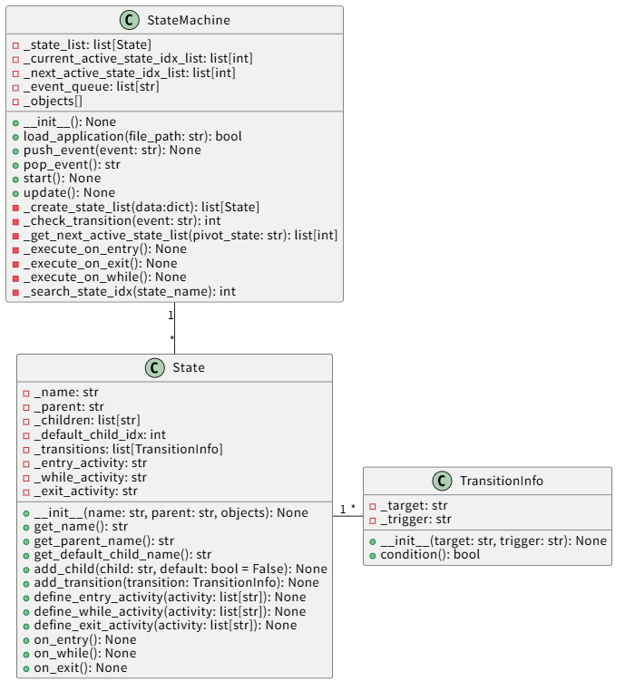

# 課題3

## 課題3の要求事項
ロボット開発におけるご自身のスキルを示すプログラムを制作してください。  
ロボットそのものを扱うプログラムでなくとも、ロボットソフトウェア開発に通じるようなアルゴリズムに関するものや、実デバイスとの接続を意識したプログラムであるとより好ましいです。  
既存の成果物を活用しても、新規に作成いただいても構いません。 

## ビルド方法・動作確認方法
* 開発言語としてPythonを採用しているためビルドは行いません。
* 動作確認方法は以下の通りです。
  * OSは、Ubuntu、Windows11のどちらでも構いません。
  * 起動方法
    * Windows11
        ```
        >cd QibiTech/src
        QibiTech/src>python state_machine.py
        ```
    * Ubuntu 
        ```
        :~$ cd QibiTech/src
        :~/QibiTech/src$ python3 state_machine.py
        ```
  * 動作の確認方法
    状態遷移は、外部ファイル`application.json`に定義しています。上記の起動方法に従って実行すると定義した内容で実行され、その結果が標準出力に表示されます。  
    今回添付した`application.json`では、以下の内容が表示されます。
    表示は、以下の書式で表示されます。

    * [<アクティブな状態名>] <実行されたアクティビティ>
    * EVENT: <入力イベント名>

    ```
    QibiTech\src>python state_machine.py
    load_application : True
    State List:
        ROOT
        POWER OFF
        POWER ON
        LAMP OFF
        LAMP ON
    Current Active State List:
    Next Active State List:
        ROOT
        POWER OFF
    [ROOT] on entry()
    [POWER OFF] on entry()
    [ROOT] ルートの活性化中の活動
    [POWER OFF] on while()

    EVENT: SW_ON
    [POWER OFF] on exit()
    [POWER ON] on entry()
    [LAMP OFF] ランプ消灯
    [ROOT] ルートの活性化中の活動
    [POWER ON] on while()
    [LAMP OFF] on while()

    EVENT: BTN_PUSH
    [LAMP OFF] on exit()
    [LAMP ON] ランプ点灯
    [ROOT] ルートの活性化中の活動
    [POWER ON] on while()
    [LAMP ON] on while()

    EVENT: BTN_PUSH
    [LAMP ON] on exit()
    [LAMP OFF] ランプ消灯
    [ROOT] ルートの活性化中の活動
    [POWER ON] on while()
    [LAMP OFF] on while()

    EVENT: SW_OFF
    [POWER ON] on exit()
    [LAMP OFF] on exit()
    [POWER OFF] on entry()
    [ROOT] ルートの活性化中の活動
    [POWER OFF] on while()
    ```

## プログラムの構成や背景（発想や狙い）
### プログラムの構成
プログラムの構成概要



### プログラムの背景（発想や狙い）
組み込みシステムにおいては状態遷移システムをコアとしたシステム開発を行うことが多くあります。  
状態遷移システムを個別のシステムごとに開発を行うとコストや日程に対するインパクトが出ます。これを軽減あるいは削減するためのソリューションとして状態遷移システムの共通化が期待されます。  
本システムでは、状態遷移システムを共通化するための方法として、遷移を行うエンジン部と状態モデルとなるステート部を分離、エンジン部は汎用ライブラリとして用意し、ステート部は具体的な実装をユーザーが行うことで、状態遷移システムを共通化することを目的とします。  
これにより先述の課題を解決できるものと考えます。

大元の発想は、前々職の現場において問題となっていた以下の点の改善策です。
* 設計と実装の区別ができていないメンバーに対する教育が難しい。
* 人により設計、実装のバラツキが大きく品質が安定しない。
* フラグとIF文の羅列による実装が横行し品質の担保が困難である。

### 仕様
本システムの仕様は以下とします。
* 状態遷移システムを共通化するため、状態遷移を行うエンジン部と状態を保持するステート部を分離する。
* エンジン部は状態遷移の管理を行い、ステート部は状態の保持と状態遷移の条件を定義する。
* ステート部の実装はユーザーが行うこととする。
* 状態遷移の条件はユーザーが定義することとする。
* ステート部の実装がユーザーによりブレることが無いよう、エンジン部が参照するデータ構造として定義できるようにする。

## 工夫した点・アピールポイント
本システムは、以下の点を特徴としています。
* 本システムのアイデアおよび基本設計は、私が過去に開発してきた自動車分野以外での自動走行システム(農機用運搬ロボット、監視用巡回ロボット、工事用鉄道機関車、小型船舶など)の技術を集約・発展させた内容となっているため、机上理論ではなく、現場での実証と改善を重ねて得られた「実践の裏打ち」がある。
* 具象となる状態定義をシステムから独立させたことで、コード属人化が抑止され保守性が向上できる。
* システムの挙動がロジックからデータに置き換えられるため、仕様からの自動生成などの生産性向上環境への対応が可能となる。
* 実デバイス/装置とのインターフェースは、それを担う専用クラスを用意し、Stateクラスから参照してアクセスする構成としている。

## AIツールを使用した場合、その内容と範囲
本課題の設計、実装についてはAIツールを使用していません。
なお、本ドキュメントの文章表現(コメントや文章の語尾、表記ゆれ、表現方法など)のチェックとしてはAIツールを利用しています。
